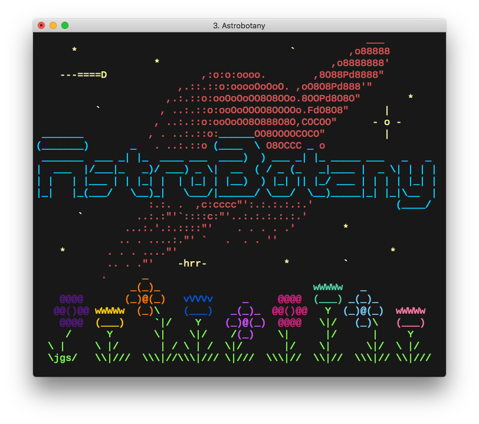

# Astrobotany

[](https://github.com/michael-lazar/astrobotany/actions)
[](https://github.com/psf/black)

A community garden over the [gemini](https://gemini.circumlunar.space/) protocol. Fork of [jifunks/botany](https://github.com/jifunks/botany).



---

<p align="center">
    🌱&nbsp;•&nbsp;🛰️&nbsp;•&nbsp;🌷&nbsp;•&nbsp;🐝&nbsp;•&nbsp;🚀&nbsp;•&nbsp;🌵&nbsp;•&nbsp;👩‍🚀<br/>
    <strong><a href="gemini://astrobotany.mozz.us">gemini://astrobotany.mozz.us</a></strong>
    <a href="https://portal.mozz.us/gemini/astrobotany.mozz.us/">(http&nbsp;proxy)</a><br/>
    🥕&nbsp;•&nbsp;🔭&nbsp;•&nbsp;🌺&nbsp;•&nbsp;👩‍🔬&nbsp;•&nbsp;🌍&nbsp;•&nbsp;👨‍🌾&nbsp;•&nbsp;🌧️
</p>

---

## Development

(requires python 3.10+)

```bash
# Download the source
git clone git@github.com:michael-lazar/astrobotany.git
cd astrobotany/

# Initialize a virtual environment and install pip dependencies, etc.
tools/boostrap

# Launch a local server
tools/astrobotany

# Initialize pre-commit hooks
pre-commit install

# Run the tests, linters, etc.
tools/pytest
tools/mypy
tools/lint

# Interact with the local database
sqlite3 data/astrobotany.sqlite
```

## ASCII Art

I used a forked version of the playscii ASCII art program to generate the ``.psci`` files:

https://github.com/michael-lazar/playscii

Botany's original art files were imported using the following settings:

- palette: ``240-ansi`` (generated using [this script](scripts/build_palette.py))
- charset: ``dos`` (of which 7-bit US ASCII is a subset)

While colorizing the images, I maintained a few common colors between plants:

| Color Code | Usage |
| --- | --- |
| 0 | background |
| 80 | soil |
| 133 | primary flower color |
| 199 | secondary flower color |
